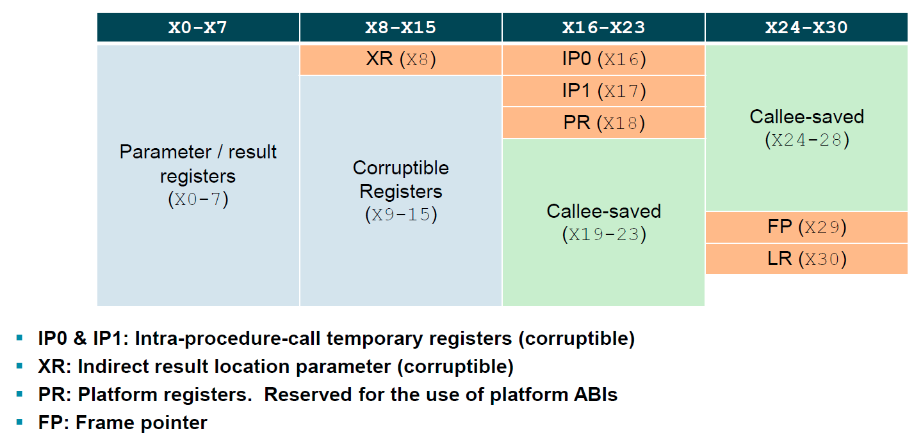
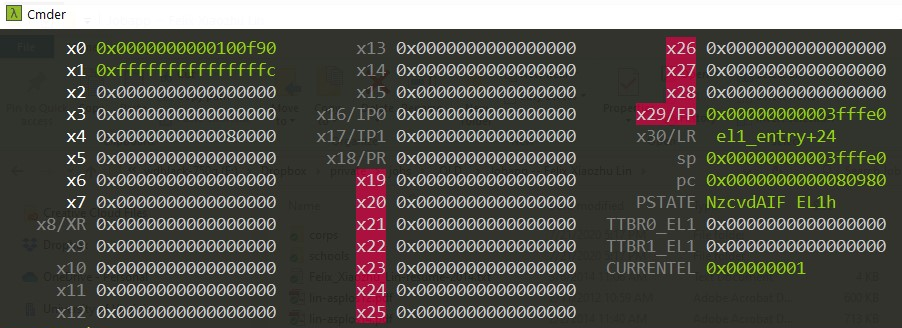

# Aarch64 cheat sheet

## General purpose registers

* x0 - x30: 64-bit general purpose registers, where:

  *  x0-x18. callee can corrupt
     *  x0-x7  Arguments and  return values.  additional arguments are on the stack
     * x8: Indirect result. For syscalls, the syscall number is in r8
  *  x19-x29: callee must preserve
     *  x9-x28: caller-saved registers. In general okay to use in your code
  * x29 (FP): frame pointer, pointing to the base of the current stack frame
  * x30 (LR): link register
* SP      Stack pointer
* PC     Program counter

Our [GDB customization](gdb.md) color-codes the registers.

White highlight (x0-x7): parameter/results; red background (x19-x29): callee saved.

(Green reg values: the values have changed since the last instruction)

## Special purpose registers

| **Control and Translation Registers**                        |
| ------------------------------------------------------------ |
| SCTLR EL{1..3}   System Control                              |
| ACTLR EL{1..3}  Auxiliary Control                            64 |
| CPACR EL1       Architectural Feature Access Control         |
| HCR EL2         Hypervisor Configuration                     64 |
| CPTR EL{2,3}    Architectural Feature Trap                   |
| HSTR EL2        Hypervisor System  Trap                      |
| HACR EL2        Hypervisor Auxiliary Control                 |
| SCR EL3         Secure Configuration                         |
| TTBR0  EL{1..3}  Translation Table Base 0 (4/16/64kb aligned)    64 |
| TTBR1  EL1       Translation Table Base 1 (4/16/64kb aligned)    64 |
| TCR EL{1..3}     Translation Control                           64 |
| VTTBR  EL2      Virt Translation Table Base (4/16/64kb aligned)  64 |
| VTCR EL2        Virt Translation Control                     |
| {A}MAIR EL{1..3} {Auxiliary} Memory Attribute Indirection         64 |
| LOR{S,E}A EL1   LORegion {Start,End} Address                64,1 |
| LOR{C,N,ID} EL1   LORegion {Control,Number,ID}           64,1 |

| **System** **Control Register (SCTLR)**                      |
| ------------------------------------------------------------ |
| M      0x00000001 MMU enabled                                |
| A      0x00000002 Alignment check enabled                    |
| C     0x00000004 Data and  unified caches enabled            |
| SA    0x00000008 Enable SP alignment check                   |
| SA0   0x00000010 Enable  SP alignment check  for EL0             E1 |
| UMA   0x00000200 Trap EL0 access of DAIF to EL1               E1 |
| I       0x00001000 Instruction cache enabled                 |
| DZE    0x00004000 Trap EL0 DC instruction to EL1               E1 |
| UCT   0x00008000 Trap EL0 access of CTR EL0 to EL1            E1 |
| nTWI  0x00010000 Trap EL0 WFI instruction to EL1              E1 |
| nTWE  0x00040000 Trap EL0 WFE instruction to EL1              E1 |
| WXN  0x00080000 Write permission implies  XN                 |
| SPAN   0x00800000 Set privileged access never                  E1,1 |
| E0E   0x01000000 Data at EL0 is big-endian                    E1 |
| EE    0x02000000 Data at EL1 is big-endian                   |
| UCI   0x04000000 Trap EL0 cache instructions to EL1             E1 |

| Secure Configuration Registers (SCR)                         |
| ------------------------------------------------------------ |
| NS   0x0001 System state is non-secure unless  in EL3        |
| IRQ   0x0002  IRQs taken to EL3                              |
| FIQ   0x0004 FIQs taken to EL3                               |
| EA    0x0008  External aborts and  SError taken to EL3       |
| SMD  0x0080 Secure monitor call disable                      |
| HCE   0x0100 Hyp Call enable                                 |
| SIF   0x0200 Secure instruction fetch                        |
| RW    0x0400 Lower  level is AArch64                         |
| ST     0x0800  Trap secure EL1 to CNTPS registers to EL3     |
| TWI   0x1000 Trap EL{0..2} WFI instruction to EL3            |
| TWE  0x2000 Trap EL{0..2} WFE instruction to EL3             |
| TLOR  0x4000 Trap LOR registers                                1 |

| **Generic** **Timer Registers**                              |
| ------------------------------------------------------------ |
| CNTFRQ EL0                  Ct Frequency (in Hz)             |
| CNT{P,V}CT EL0               Ct {Physical,Virtual} Count   RO,64 |
| CNTVOFF EL2                 Ct Virtual Offset              64 |
| CNTHCTL  EL2                 Ct Hypervisor Control           |
| CNTKCTL   EL1                 Ct Kernel Control              |
| CNT{P,V} {TVAL,CTL,CVAL} EL0 Ct {Physical,Virtual} Timer     |
| CNTHP {TVAL,CTL,CVAL} EL2   Ct Hypervisor Physical Timer     |
| CNTPS {TVAL,CTL,CVAL} EL1    Ct Physical  Secure Timer       |
| CNTHV {TVAL,CTL,CVAL} EL2   Ct Virtual Timer                 1 |

## Exception levels

| AArch64/ARMv8 name |                          remarks                           |
| :----------------: | :--------------------------------------------------------: |
|        EL3         |        highest exception level, mostly for firmware        |
|        EL2         | exception level for hypervisors like Xen (or parts of KVM) |
|        EL1         |            the Linux kernel is running in this             |
|        EL0         |                 for unprivileged userland                  |

### Exception vectors

EL1t Exception is taken from EL1 while stack pointer was shared with EL0. This happens when SPSel register holds the value 0.

EL1h Exception is taken from EL1 at the time when dedicated stack pointer was allocated for EL1. This means that SPSel holds the value 1 and this is the mode that we are currently using.

EL0_64 Exception is taken from EL0 executing in 64-bit mode.

EL0_32 Exception is taken from EL0 executing in 32-bit mode.

## PSTATE

See "Fundamentals of ARMv8-A", Chapter "Processor state"

## Return from exceptions

**ELR_EL1**, Exception Link Register. "When taking an exception to EL1, holds the address to return to."

**SPSR_EL1,** status regs, including irq enable/disable

**eret**. Returns from an exception. It restores the processor state based on SPSR_ELn and branches to ELR_ELn, where n is the current exception level.

## Common instructions

- [A more detailed instruction quick reference](./aarch64-instr-quick-ref.pdf)

* mrs	Load value from a system register to one of the general purpose registers (x0–x30)
* and	Perform the logical AND operation.
* cbz	Compare the result of the previously executed operation to 0 and jump (or `branch` in ARM terminology) to the provided label if the comparison yields true.
* b		Perform an unconditional branch to some label.
* adr	Load a label's relative address into the target register. In this case, we want pointers to the start and end of the `.bss` region.
* sub	Subtract values from two registers.
* bl	"Branch with a link": perform an unconditional branch and store the return address in x30 (the link register). When the subroutine is finished, use the `ret` instruction to jump back to the return address.
* mov	Move a value between registers or from a constant to a register.
* cbz, cbnz	Compare and Branch on Zero, Compare and Branch on Non-Zero.
* stp 	store a pair of registers

| **Condition  Codes**               |
| --------------------------------------------------- |
| EQ    Equal                        Z                |
| NE    Not  equal                     !Z             |
| CS/HS  Carry set, Unsigned higher or same C         |
| CC/LO  Carry clear, Unsigned lower       !C         |
| MI     Minus, Negative               N              |
| PL     Plus, Positive or zero            !N         |
| VS    Overflow                     V                |
| VC    No overflow                   !V              |
| HI      Unsigned higher                C & !Z       |
| LS    Unsigned lower or same           !C \| Z      |
| GE    Signed greater than or equal      N = V       |
| LT     Signed less than                N /= V       |
| GT     Signed greater than             !Z &  N = V  |
| LE    Signed less than or equal         Z \| N /= V |
| AL     Always (default)                 1           |

## Architecture naming

There is an updated ARM architecture revision called "ARMv8", which evolved from the ARMv7 architecture. Among other things it introduces a new execution state called "AArch64", which provides a full 64-bit architecture.

ARMv8 compliant implementations can provide this state or not, also they are free to implement the "AArch32" state, which closely resembles the ARMv7 architecture. So both 32-bit and 64-bit states are optional - but you should of course have at least one ;-). ARM Cortex cores provide both states, while there are implementations from other vendors which do not provide AArch32, for instance.

The Linux kernel chose to call this new architecture "arm64", the same name got picked up by Debian for their architecture port name.

The GNU toolchain however elected the official "aarch64" name for the port, so the GCC (cross-)compiler is usually called "aarch64-linux-gnu-gcc". So although the arm64 name is not official, it can be used interchangeably for aarch64.

## References

This page incorporates many contents from various sources.

* ARM documentation on Aarch64 ISA, https://developer.arm.com/documentation/ddi0602/latest/
* ARM documentation on Aarch64 registers, https://developer.arm.com/documentation/ddi0601/latest/
* ARM documentation on Aarch64/Aarch32 address translation, https://developer.arm.com/documentation/100940/latest/
* "arm64 assembly crash course", https://github.com/Siguza/ios-resources/blob/master/bits/arm64.md
* https://linux-sunxi.org/Arm64#ARM64_cheat_sheet
* https://wiki.cdot.senecacollege.ca/wiki/AArch64_Register_and_Instruction_Quick_Start
* https://tc.gts3.org/cs3210/2020/spring/r/AArch64-ISA-Cheat-Sheet.pdf
* "ARMv8 A64 Quick Reference", https://github.com/flynd/asmsheets

