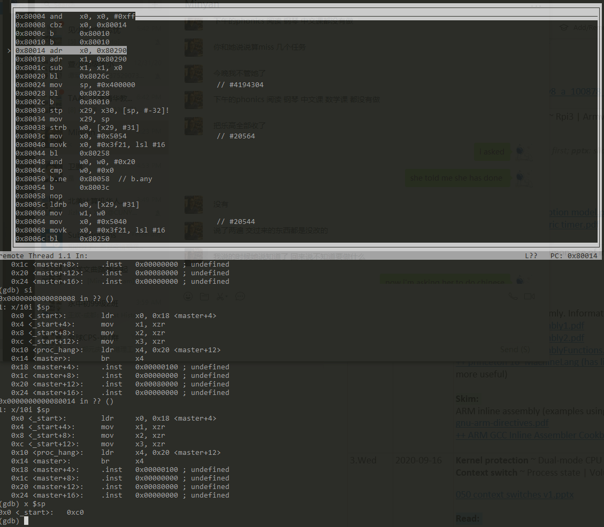
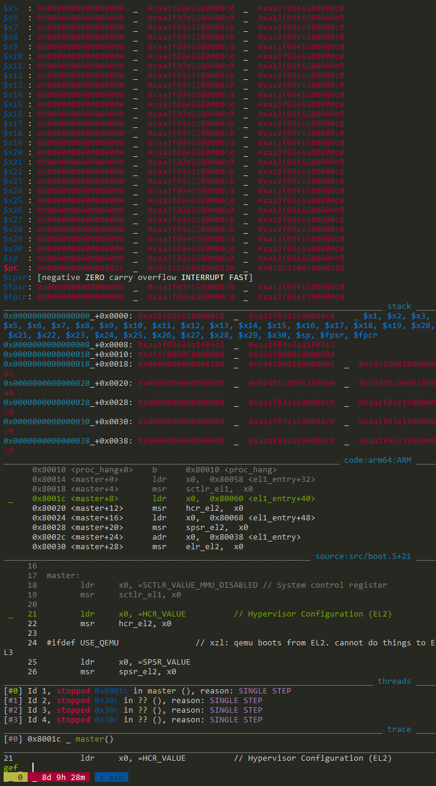

# Using GDB to debug kernel 

**Note (WSL users)**: It seems GDB server does not play well with WSL… see below. 

# Installation 

Linux or WSL: 
```
sudo apt install gdb-multiarch gcc-aarch64-linux-gnu build-essential 
```
Note: the gdb for aarch64 is not called aarch64-XXXX-gdb.

## Basic Usage

From one terminal 

```
qemu-system-aarch64 -M raspi3 -kernel ./kernel8.img -serial null -serial stdio -s -S 
```

From another terminal (the elf is needed if we need debugging info)

```
gdb-multiarch build/kernel8.elf 
(gdb) target remote :1234 
(gdb) layout asm 
```

Single step 

```
(gdb) si 
```


## Dump register contents

```
(gdb) info reg 
```


show reg information at each step. This example shows 
```
display/10i $sp
```



## Dump memory

dump memory. can specify a symbol or a raw addr 

... as instructions

```
x/20i _start
```
... as hex (bytes)
```
x/20xb _start
```

... as hex (words)
```
x/20xw _start
```
... as a textual string
```
x/s _start
x/s $x0
```

## Print out variables/structures

```
print *mem_map
```

print the first 10 elements of mem_map, a pointer of type short*

```
print (short[10])*mem_map
```

## Set a breakpoint at addr

```
b *0xffff0000
```

## Function/source lookup

type of a given symbol 
```
ptype mem_map
```

find out function name at a given addr
```
info line *0x10000000
```

list source at a given addr
```
list *0x10000000
list *fn 
```

# Enhancement 

I recommend GEF (https://github.com/hugsy/gef) and GDB-dashboard (https://github.com/cyrus-and/gdb-dashboard). Based on my quick test: 

* Both enhanced GDB significantly. 

* GEF understands aarch64 semantics (e.g. CPU flags) very well. It can even tell why a branch was taken/not taken. However, GEF does not parse aarch64 callstack properly (at least I cannot get it work). 

* GDB-dashboard nicely parses the callstack. It, however, does not display aarch64 registers properly. 

GEF screenshot (note the CPU flags it recognized)



I slightly adapted GDB-dashboard for aarch64: https://github.com/fxlin/gdb-dashboard-aarch64

```
wget -P ~ https://raw.githubusercontent.com/fxlin/gdb-dashboard-aarch64/master/.gdbinit
```

Results: 


The best documentation of gdb-dashboard seems from typing`help dashboard` in the GDB console. Examples:

```
>>> help dashboard expressions 
```

All GDB commands still apply.

## Troubleshooting 

"gdbserver: Target description specified unknown architecture “aarch64” 
https://stackoverflow.com/questions/53524546/gdbserver-target-description-specified-unknown-architecture-aarch64 
It seems GDB server does not play well with WSL… be aware! 

## Reference 

Launch qemu with gdb 

https://en.wikibooks.org/wiki/QEMU/Debugging_with_QEMU#Launching_QEMU_from_GDB 

more info about gdb for kernel debugging 

https://wiki.osdev.org/Kernel_Debugging 

Good article

https://interrupt.memfault.com/blog/advanced-gdb#source-files


```

```